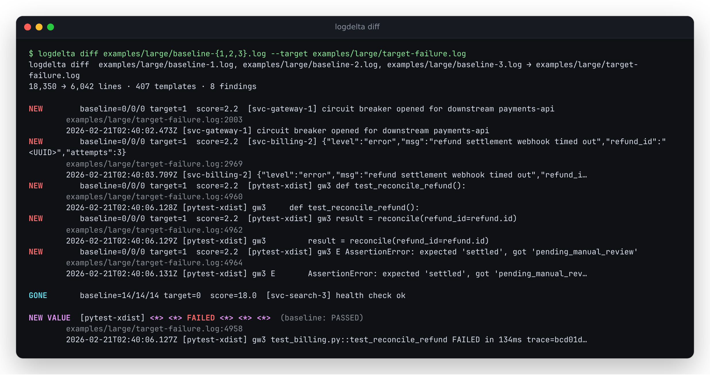
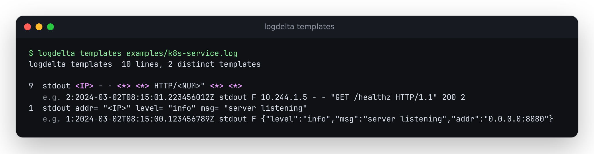
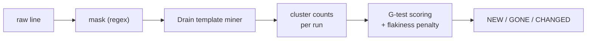

# logdelta

**Diff logs by meaning, not by bytes. See what's new in the failing run.**

[](https://github.com/antonsoo/logdelta/actions/workflows/ci.yml)
[](LICENSE)

When a CI job or a deploy fails, the useful question is "what happened in this run that
didn't happen in the good one?" Plain `diff` can't answer it: timestamps, PIDs, durations,
UUIDs, ports, and line order all differ between any two runs, even two passing ones, so a
byte-level diff of a 4,000-line CI log is 3,990 lines of noise. `logdelta` turns each line
into a *template* by masking the variable parts, clusters the templates, and compares
template distributions between a known-good baseline and the run you're investigating.

<p align="center"></p>

## Quickstart

```console
$ cargo install --git https://github.com/antonsoo/logdelta
$ git clone https://github.com/antonsoo/logdelta && cd logdelta
$ logdelta diff examples/k8s-service.log --target examples/k8s-service-incident.log
```

That last command is exactly what produced the screenshot above, against the synthetic
fixtures committed in this repo — no setup needed, just try it.

## Features

- **`logdelta diff <baseline>... --target <file>`** — reports templates that are **NEW** in
  the target, **GONE** from it (present in every baseline), or significantly **CHANGED** in
  frequency, each with counts, the template (variables highlighted), the first matching
  target line, and `-C N` context lines. Pass multiple baselines to down-weight templates
  that are already noisy across passing runs, so flaky lines don't drown out real findings.
- **`logdelta templates <file>`** — the top templates in a file, ranked by count, with an
  example line for each.
- **`logdelta novel --baseline <file>... [target|-]`** — a streaming filter: prints only
  lines whose template has never appeared in the baseline(s). Flushes per line, so
  `tail -f app.log | logdelta novel --baseline last-week.log` surfaces new behavior live.
- **Masking**: ISO 8601/RFC 3339 and syslog timestamps, epoch seconds/ms, UUIDs, hex
  ids/hashes, IPv4 with ports, IPv6 (uncompressed and bracketed forms — see
  [Limitations](#accuracy-and-limitations)), emails, URL query strings and numeric/hex/UUID
  path segments, quantities and durations (`512KiB`, `12ms`, `01:23:45`), temp paths, and
  ANSI escapes — plus `--mask REGEX` (repeatable) and `--mask-file` for your own patterns.
- **Inputs**: files, stdin (`-`), and `.gz` transparently; non-UTF-8 bytes are handled
  lossily instead of crashing.
- **Output**: colored terminal output (TTY auto-detected, override with `--color`),
  `--json`, and `--markdown` for `$GITHUB_STEP_SUMMARY` or a PR comment.
- Streams line-by-line: peak memory stays under ~7 MB on a 10-million-line log (see
  [Benchmarks](#benchmarks)).

## Usage

```console
$ logdelta templates examples/k8s-service.log
```

<p align="center"></p>

```console
$ logdelta diff examples/pytest-pass.log --target examples/pytest-fail.log --markdown
```

```markdown
### logdelta diff

Baseline: `examples/pytest-pass.log` (14 lines) — Target: `examples/pytest-fail.log` (23 lines)

#### New

| Score | Baseline | Target | Template | First seen |
|---:|---:|---:|---|---|
| 0.2 | 0 | 1 | `=================================== FAILURES ====================================` | `examples/pytest-fail.log:14` ... |
| 0.2 | 0 | 1 | `E ZeroDivisionError: division by zero` | `examples/pytest-fail.log:20` ... |
| 0.2 | 0 | 1 | `=========================== 1 failed, 6 passed in <QTY> ==========================` | `examples/pytest-fail.log:23` ... |

#### Gone

| Score | Baseline | Target | Template | First seen |
|---:|---:|---:|---|---|
| 1.2 | 1 | 0 | `============================== 7 passed in <QTY> ===============================` | — |
```

(Trimmed for the README; `--markdown` output is what's shown in this repo's own CI — see
[`docs/github-actions.md`](docs/github-actions.md) for the full recipe.)

```console
$ tail -f service.log | logdelta novel --baseline yesterday-passing.log
```

prints only the lines whose template didn't occur in `yesterday-passing.log`, as they
happen.

## How it works



**1. Masking** (`src/mask.rs`) replaces the parts of a line that vary run-to-run —
timestamps, ids, durations, and so on — with placeholder tokens like `<TS>` or `<UUID>`,
using a fixed, ordered sequence of regexes (custom `--mask` patterns run first, so they take
priority). It deliberately does *not* try to catch every variable value: short numbers (exit
codes, HTTP statuses, retry counts) are left as literal tokens on purpose, because they're
often the signal, not the noise, and because the next stage handles them anyway.

**2. Template mining** (`src/drain.rs`) implements Drain, an online log parsing algorithm
(P. He, J. Zhu, Z. Zheng, M. R. Lyu, "Drain: An Online Log Parsing Approach with Fixed Depth
Tree," IEEE ICWS 2017, pp. 33-40): each masked line is tokenized by whitespace, routed to a
small set of candidate clusters by `(token count, first token)`, compared against each
candidate by the fraction of tokens that match exactly (a cluster's own `<*>` wildcard
positions always count as a match), and merged into the best match above a similarity
threshold (default `0.5`) — wildcarding any position that still disagrees — or used to start
a new cluster if nothing matches well enough. This is where the short numbers masking left
alone get generalized: if a position varies across enough real examples of an otherwise
identical line, Drain wildcards it regardless of whether a regex would have caught it.

The original paper routes lines through a fixed-depth tree keyed on several leading tokens,
with an early wildcard branch for tokens containing digits. This implementation uses a
two-level index (`token count`, then first token) instead: because masking already turns
almost every digit-bearing field into a placeholder before mining starts, and because CI/
service logs rarely have more than a handful of distinct templates sharing a first token,
the two-level index gives the same groupings as the full-depth tree on every case in this
repo's fixtures, more simply. Processing one baseline/target pair — or the whole `diff`
comparison — is single-threaded, so clusters are matched and created in a fixed input order
with a deterministic tie-break: output is a pure function of the input.

For `diff`, every baseline and the target are mined into *one shared* Drain instance
(baselines first, then the target) so cluster ids and templates line up across runs.

**3. Scoring** (`src/scoring.rs`) — for each template, `diff` computes a G-test
(log-likelihood-ratio test) on the 2x2 table {this template, every other template} x
{baseline(s), target}, the same construction T. Dunning uses for comparing word frequencies
between corpora ("Accurate Methods for the Statistics of Surprise and Coincidence,"
*Computational Linguistics* 19(1), 1993, pp. 61-74), applied to log templates. Every cell
gets Laplace smoothing (`+0.5`) so a zero count never produces `ln(0)`. A template is
**NEW** if it has zero baseline occurrences and at least one in the target; **GONE** if the
reverse (present in *every* baseline, absent from the target); otherwise it's **CHANGED**
if its G-score clears a significance cutoff (default `10.83`, the p < 0.001 chi-square
critical value for 1 degree of freedom — G is asymptotically chi-square distributed under
the null hypothesis of equal rates).

With more than one baseline, each template's per-run rate (`count / lines`) is also
computed per baseline. The raw G-score is divided by `1 + 2 * cv`, where `cv` is the
coefficient of variation (`stddev / mean`) of those per-baseline rates: a template whose
frequency already swings between passing runs gets its score pulled down, so it takes a
bigger shift in the target to still clear the significance bar. A template seen at a
near-constant rate across baselines gets no such discount.

## Accuracy and limitations

- **Frequency-based, not content-based.** `diff` only sees that a template's *count*
  changed. A line whose *content* flips but whose count doesn't (e.g. pytest's own
  `test_divide PASSED` becoming `test_divide FAILED`, same position, same frequency) won't
  be flagged by itself — see `examples/pytest-pass.log` vs. `examples/pytest-fail.log`: the
  status-word flip is invisible to the scorer, but everything downstream of it (the
  `FAILURES` banner, the traceback, the changed summary line) is exactly what does get
  flagged, which is usually enough in practice.
- **Regex masking is necessarily incomplete.** It won't recognize a project-specific id
  format, a non-English date, or a base64 blob as a "temp path with random components"
  unless you add a `--mask`. Drain's own wildcarding is the second line of defense, but it
  only generalizes a token position once it has seen it vary.
- **Hex-id masking requires 7-40 hex characters *and* at least one letter**, so short (≤6
  char) hex ids and purely-numeric hex-looking strings are not masked (the latter are
  usually genuine numbers, not hashes).
- **Bare compressed IPv6 addresses (`::1`, `fe80::1`) are not masked outside brackets.**
  `regex` (the crate) has no look-around, and `::` is also the namespace/path separator in
  Rust, C++, and similar (`std::io::Error`, `a::b::c`) — supporting general `::`
  compression would mask those constantly. `logdelta` masks the unambiguous cases instead:
  fully-written-out IPv6 (`fe80:0:0:0:0:0:0:1`) and the bracketed form (`[::1]:8080`,
  `[2001:db8::1]`) that log formats use specifically to disambiguate an address from a port.
- **Epoch timestamp masking is a 10/13-digit heuristic** (`\b1[0-9]{9}(?:[0-9]{3})?\b`): a
  coincidental 10-13 digit number that isn't a timestamp will still be masked.
- **`-C` context requires a re-readable target** (a real file, not stdin), since it's
  collected with a second pass over the file.
- **No cross-machine template alignment beyond this run.** Each `diff` invocation mines a
  fresh Drain instance; there's no persisted template database across invocations (unlike,
  e.g., Drain3's checkpointing). For a CI use case this is the right tradeoff — every run
  should be judged against the baselines you pass it, not a slowly-drifting global state —
  but it means two separate `diff` calls won't share cluster ids.
- Regressions were checked against hand-verified expected output for every fixture (see
  `tests/integration.rs` and the `insta` snapshots in `tests/snapshots/`), not against an
  independent log-parsing oracle — there isn't a simple closed-form "correct" template set
  for arbitrary text to check against.

## Benchmarks

Measured on this machine (AMD Ryzen 7 7800X3D, 14 vCPUs allotted under WSL2, 48 GiB RAM),
`cargo build --release`, synthetic 1M/10M-line logs generated by
[`bench/gen_bench_log.rs`](bench/gen_bench_log.rs):

| Command | Lines | Throughput | Peak RSS |
|---|---:|---:|---:|
| `templates` | 1,000,000 | ~342k lines/s (~28 MB/s) | 7.0 MB |
| `templates` | 10,000,000 | ~221k-339k lines/s (~18-27 MB/s, contended) | 7.1 MB |
| `diff` (1M + 1M) | 2,000,000 | ~364k lines/s | 7.2 MB |

Full methodology, including why the 10M numbers have a wide range (concurrent unrelated
builds on the same box during measurement), is in [`bench/RESULTS.md`](bench/RESULTS.md).
The headline: **memory is flat regardless of input size** — a few MB whether the log is
10,000 or 10,000,000 lines — because nothing buffers the input; it's dominated by the
(small) number of distinct templates found, not by line count.

## Development

```console
$ cargo test
$ cargo fmt --all -- --check
$ cargo clippy --all-targets --all-features -- -D warnings
```

See [`CONTRIBUTING.md`](CONTRIBUTING.md).

## License

[MIT](LICENSE) © 2026 Anton Soloviev
