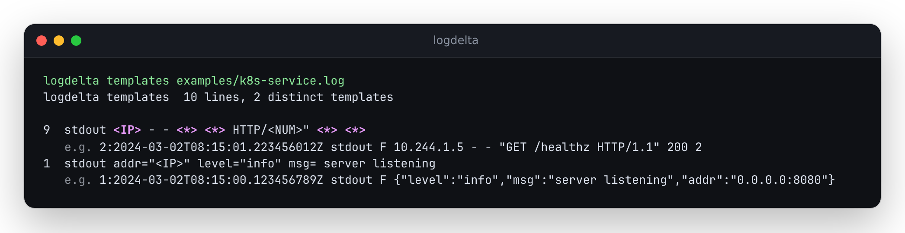
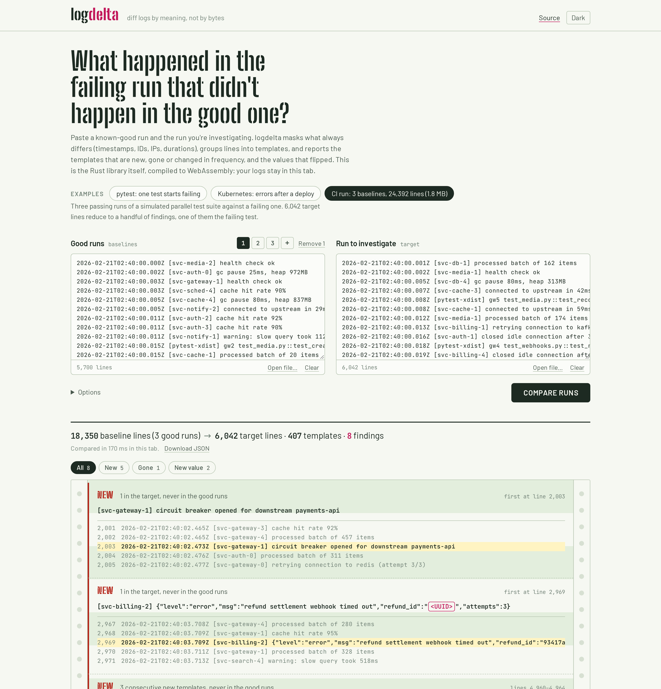
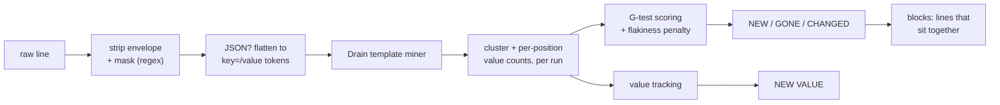

# logdelta

**Diff logs by meaning, not by bytes. See what's new in the failing run.**

[](https://crates.io/crates/logdelta)
[](https://docs.rs/logdelta)
[](LICENSE)
[](https://antonsoo.github.io/logdelta/)

When a CI job or a deploy fails, the useful question is "what happened in this run that
didn't happen in the good one?" Plain `diff` can't answer it: timestamps, PIDs, durations,
UUIDs, ports, and line order all differ between any two runs, even two passing ones, so a
byte-level diff of a 4,000-line CI log is 3,990 lines of noise. `logdelta` turns each line
into a *template* by masking the variable parts, clusters the templates, and compares
template distributions between a known-good baseline and the run you're investigating.
Lines that are one event, such as a traceback or the steps a failed job skipped, are reported
as one finding. On the synthetic 18,000-line, three-baseline example below — a simulated
parallel test run with a real failure buried in it — that's a 6,042-line target reduced to 5
findings, one of them the failing test's traceback. The example's passing runs diffed
against each other give 0 or 1: the one is its retry line, which the three runs print 200,
1,100 and 550 times.

<p align="center"></p>

## On real logs

Two studies in this repository run logdelta on public data with a known answer. The numbers
are the released 0.3.4 against this checkout.

- **[264 failed Kubernetes builds, each against a passing build of the same commit](studies/kubernetes-ci/README.md).**
  Same code, one run failed: what differs between the two logs is the failure. Naming the
  failed test is easy: the diff does it in 264 of 264, and so does `grep -- '--- FAIL'`.
  What a diff adds is the reason. The failed test's own assertion line is in logdelta's
  report in **212 of 239** cases (89%), in a median of **40.5 lines** out of a 2,600-line log;
  the grep never shows it, and a plain set difference shows it in 1,275 lines. The source
  checkout now keeps source diagnostics and error markers visible inside abbreviated
  blocks. Before that change it showed 159, in 34 lines: **53 additional cases**, with none
  of those 159 lost. This is measured on the same logs used to develop the excerpt rule,
  not on held-out projects. [What the excerpt keeps and misses](docs/diagnostic-excerpts.md).
- **[Loghub, the benchmark log parsers are scored on](studies/loghub/README.md).** 2,000
  hand-labelled lines from each of 16 systems. Grouping accuracy went from **0.73 to 0.82**
  on the message text and from **0.43 to 0.71** on whole lines, which is what logdelta is
  given in use. Those "after" numbers are in-sample: the changes were chosen by reading this
  benchmark's errors. The reference Drain publishes 0.865 with a log format, regexes and a
  threshold chosen per system; run with one setting for all sixteen it scores 0.70, and
  logdelta runs one configuration on all sixteen.

What 0.3.4 got wrong, and where it was found:

- A line was filed under its first token, which in many logs is a value: a host, an id, a
  count. Each value was a template of its own. (Loghub; and Kubernetes' klog, where the
  first token is the date, so every line was new the day after the baseline.)
- A wildcard counted as agreement, so a template got easier to join with every line it took
  in. One ended up holding 343 Android lines of 27 different templates, and a line that fits
  a template like that is never new. (Loghub.)
- Two JSON lines with the same keys were one template whatever they said. A new
  `"level":"error"` line with a message no baseline had came back as **"No significant
  differences found."** (Found while writing a test, not in either study.)
- Apache's error-log timestamp, `[Sun Dec 04 04:47:44 2005]`, was not masked, nor the access
  log's `04/Dec/2005:04:47:44 +0000`. (Loghub.)

**[Try it in the browser →](https://antonsoo.github.io/logdelta/)** Paste two logs, or load one of
the examples below. The page runs this crate's library compiled to WebAssembly, so the findings are
the CLI's, computed in your tab; nothing is uploaded, and the page's Content-Security-Policy
(`connect-src 'self'`) has the browser enforce that. See [Web demo](#web-demo).

## Quickstart

```console
$ cargo install logdelta
$ git clone https://github.com/antonsoo/logdelta && cd logdelta
$ logdelta diff examples/large/baseline-{1,2,3}.log --target examples/large/target-failure.log
```

That last command, against the synthetic fixtures committed in this repo, is exactly what
produced the screenshot above — no setup needed, just try it. `cargo install logdelta`
builds the crate from [crates.io](https://crates.io/crates/logdelta) (Rust 1.85 or newer).
Each [GitHub release](https://github.com/antonsoo/logdelta/releases) also carries a static
Linux x86-64 binary, `logdelta-x86_64-unknown-linux-musl.tar.gz`, with its SHA-256.

`logdelta diff` exits 0 when it finds nothing significant, 1 when it reports a finding, and 2
when it could not read its input (a missing file, or one that is not text), like `diff` and
`grep`. In this source checkout, an incomplete explicit field watch also exits 2.

## Features

- **Exact JSON field watches (unreleased)**: `--watch-field /http/status` catches a
  `200` to `503` change that numeric masking would hide. Select one or more scalar
  fields; inspect per-run counts, source lines and coverage in the CLI or browser.
  Browser ledgers offer search, paged counts, and source excerpts for the visible rows;
  [downloads retain the complete evidence](docs/verification-field-ledger.md).
  An unobserved field or a tracking limit produces an incomplete report, never a
  clean CI gate. See the [controlled HTTP example and field guide](docs/watched-fields.md).
  Add `--watch-by /route` to compare outcomes separately for each route: an expected
  `503` from maintenance can no longer hide checkout's first `503`. Repeat it for a
  composite key, such as service and route. New groups are identified separately
  from changed outcomes in observed groups. The [mixed-route capture](docs/watched-fields.md#compare-within-routes-or-services)
  checks the finding against 120 actual loopback HTTP responses.
  Add [`--watch-rate-change 5`](docs/field-rates.md), or enable **Compare rates of
  known values** in the browser, to catch an
  already-known error becoming common: the retained 6,000-response capture goes
  from 1.0-1.2% checkout errors to 20%. Reports show group denominators, baseline
  variation and source records; unobserved group rates cannot pass a CI gate.
  The browser example **HTTP: a known error becomes common** replays the capture
  and lets you inspect both the rate changes and the unchanged maintenance route.

- **`logdelta diff <baseline>... --target <file>`** — reports templates that are **NEW** in
  the target, **GONE** from it (present in every baseline), or significantly **CHANGED** in
  frequency, plus **NEW VALUE** findings for a same-frequency content flip at a
  low-cardinality position (see [How it works](#how-it-works)) — each with counts, the
  template (variables highlighted), the first matching target line (for GONE, the line the
  first baseline had), and `-C N` context lines. Pass multiple baselines to down-weight
  templates that are already noisy across passing runs, so flaky lines don't drown out real
  findings.
- **Blocks**: findings whose lines sit together are one finding. A traceback is one NEW
  block that shows its lines with their numbers (in a failing job of the pytest project, 77 lines that
  were 51 findings in 0.2); the steps a failed job skipped are one GONE block. A stack trace logged fifty times is still one
  block, with the count. `--block-lines N` sets how much of a long block is printed
  (default 12: its boundaries and diagnostic markers; `0` shows every representative),
  with omitted template counts and the original line numbers. This is a display heuristic:
  ordinary test logging can use the same source-location prefixes as assertions.
  `--flat` lists every template on its own, as
  versions before 0.3 did.
- **`logdelta templates <file>`** — the top templates in a file, ranked by count, with an
  example line for each.
- **`logdelta novel --baseline <file>... [target|-]`** — a streaming filter: prints only
  lines whose template has never appeared in the baseline(s). Flushes per line, so
  `tail -f app.log | logdelta novel --baseline last-week.log` surfaces new behavior live.
- **Structural envelopes**: CRI/containerd (`kubectl logs`) prefixes, journald/syslog
  headers, the Docker `json-file` wrapper, and bare leading timestamps (GitHub Actions'
  raw-log shape) are stripped before mining, keeping only what's worth comparing on (e.g.
  the stream name).
- **JSON- and logfmt-aware**: a single-line JSON payload is read as fields, not shredded by
  a whitespace split. A field whose value is a sentence (`"msg":"user alice logged in"`,
  `msg="..."` in logfmt) is mined as its words; every other field is an attribute,
  `level="info"`, that keeps its name when its value varies (`level=<*>`). In this checkout
  the words decide which template a line belongs to and the attributes do not, so two events
  with the same fields and different messages are two templates.
- **One instance going quiet** (unreleased): when a template is shared by a fixed set of
  sources (`[svc-search-0]` … `[svc-search-4]`) and one of them stops writing it, that is a
  GONE finding for that instance's line, with its counts.
- **Masking**: ISO 8601/RFC 3339 and syslog timestamps (and, unreleased, `ctime`, RFC 2822
  and Common Log Format ones, and durations like `1m6.046s`), epoch seconds/ms, UUIDs, hex
  ids/hashes, IPv4 with ports, IPv6 (uncompressed and bracketed forms — see
  [Limitations](#accuracy-and-limitations)), emails, URL query strings, basic-auth
  credentials, and numeric/hex/UUID path segments, quantities and durations (`512KiB`,
  `12ms`, `01:23:45`), temp paths, test-runner progress lines (`....s...F.. [ 42%]`), and
  terminal escape sequences (colors, hyperlinks) — plus `--mask REGEX` (repeatable) and
  `--mask-file` for your own patterns.
- **Inputs**: files, stdin (`-`), and `.gz` transparently; non-UTF-8 bytes are handled
  lossily instead of crashing.
- **Output**: colored terminal output (TTY auto-detected, override with `--color`, raw
  lines truncated to the real terminal width instead of wrapping mid-word), `--json`, and
  `--markdown` for `$GITHUB_STEP_SUMMARY` or a PR comment. Reports print log lines without
  the log's own color codes and control characters; `--json` keeps every line as it was read.
- Streams line-by-line: peak memory stays flat regardless of input size (see
  [Benchmarks](#benchmarks)).

## Usage

```console
$ logdelta templates examples/k8s-service.log
```

<p align="center"></p>

```console
$ logdelta diff examples/pytest-pass.log --target examples/pytest-fail.log --markdown
```

````markdown
### logdelta diff

Baseline: `examples/pytest-pass.log` (28 lines) — Target: `examples/pytest-fail.log` (23 lines) — 21 templates, 3 findings (10 before grouping)

#### New

**8 templates, 8 lines** at `examples/pytest-fail.log:14-23`, score 6.1

```text
    14 | =================================== FAILURES ====================================
    15 | _________________________________ test_divide ____________________________________
    17 |     def test_divide():
    18 |         result = divide(10, 0)
    19 | >       assert result == 0
    20 | E       ZeroDivisionError: division by zero
    22 | tests/test_math.py:23: ZeroDivisionError
    23 | =========================== 1 failed, 6 passed in 0.51s ==========================
```

#### Gone

| Score | Baseline | Target | Template | Last seen |
|---:|---:|---:|---|---|
| 1.2 | 2 | 0 | `============================== <*> passed in <QTY> ===============================` | `examples/pytest-pass.log:14` ... |

#### New value

| Template | New value | Baseline value(s) | First seen |
|---|---|---|---|
| `tests/test_math.py::test_divide <*> [ <*>` | `FAILED` | `PASSED` | `examples/pytest-fail.log:9` ... |
````

The traceback is one block: eight lines that are each a template the baseline never had,
listed with their line numbers (16 and 21 are blank lines, which the baseline has too). The last table is the interesting one: `test_divide`'s outcome flipping from `PASSED` in the
baseline to `FAILED` — same line, same position, same frequency — is exactly the case
frequency-based scoring alone can't see (more in [How it works](#how-it-works)). (This is
also why `examples/pytest-pass.log` shows `test_divide` re-run a few extra times, as a
stability check on a division test would really do: NEW VALUE only fires once a position's
baseline values are established enough — see the cardinality/repetition rules below —
so a status seen exactly once wouldn't qualify.)

(The two table cells ending in `...` are trimmed for the README. This repo doesn't run `logdelta` on itself — `--markdown` is meant
for pasting straight into `$GITHUB_STEP_SUMMARY` or a PR comment; see
[`docs/github-actions.md`](docs/github-actions.md) for a worked recipe.)

```console
$ tail -f service.log | logdelta novel --baseline yesterday-passing.log
```

prints only the lines whose template didn't occur in `yesterday-passing.log`, as they
happen.

### As a library

The CLI is a thin layer over the `logdelta` crate, which you can call directly. Add it
without the command-line dependencies:

```toml
[dependencies]
logdelta = { version = "0.3", default-features = false }
```

`logdelta::analysis::diff_lines` diffs any sources of lines (files, stdin, text in
memory) and returns the findings and the blocks they form as plain structs; `diff_runs`
does the same over file paths. The [API docs](https://docs.rs/logdelta) open with a complete example.

## Web demo

<p align="center"></p>

[antonsoo.github.io/logdelta](https://antonsoo.github.io/logdelta/) is a static page in `web/`.
`web/wasm` wraps the library in a small C ABI (a JSON request in, the `diff` JSON out, no
wasm-bindgen), `cargo build --target wasm32-unknown-unknown` compiles it, and a Web Worker runs
it off the main thread. It is the same masking, mining and scoring code as the CLI: on the
three-baseline example it reports the same 16 templates, 8 findings and one block as
`logdelta diff ... --json`, in under a second once the 1.2 MB module has loaded. The
library builds without the command-line dependencies (`default-features = false`; `clap` and
`terminal_size` sit behind the default `cli` feature), and `diff_lines` / `mine_lines` take any
line iterator, so the page diffs pasted text directly.

The worker imports a fingerprinted engine asset; rebuilding the binary changes its URL
and the worker's dependency, so a newly loaded interface cannot reuse an older engine
cached under the former fixed `logdelta.wasm` URL. Each portable report records the SHA-256
of the exact bytes instantiated by its worker. This identifies the executed artifact;
it is not a signature or an independent audit of the engine.

The browser build follows Cargo's actual artifact record, including with custom target
directories. Checkout and dependency-cache paths are remapped, and Cargo's WASM crate
metadata is stabilized so the same source and toolchain rebuild identically from another
checkout. Caller compiler flags and wrappers are retained. See the
[engine build guide](docs/wasm-build.md) for configuration, verification and limits.

A block is one card. A new block shows the target as it reads from the block's first line to
its last (cut to its start and end when long, with a button for the rest); a gone block shows
one line of the first good run per template. NEW VALUE findings are listed right after the new
lines. The counts and the blocks are the engine's. Files can be dropped or opened, `.gz`
included. Each import stays assigned to the log where it began, even if you switch baseline
tabs. Newer imports, typing, Clear and removing a baseline supersede its pending read.

**Cancel** stops pending imports, example downloads and comparisons while keeping loaded
logs and the last completed report. Editing a log or an option also cancels an unfinished
comparison. **New comparison** clears the workspace and restores the default options.
An older completed report remains labelled when inputs change: its excerpts and downloads
always refer to the sources and settings captured when that comparison started.

Open **Compared sources and settings** to map baseline counts to input names and see the
applied masks, exact field watches, grouping keys, rate threshold and context. Blank, unused baseline editors are listed as omitted; an empty
file or **Use empty log** is an intentional input and is included. An empty target can
therefore show the lines that disappeared from the good runs. Editing an imported log marks
its source name as edited.

| Download | Contents |
| --- | --- |
| **Download report** | `logdelta-report.json`: format `logdelta-report`, schema version 1 (pooled novelty), 2 (grouped novelty), or 3 (rates requested), engine version and executed module SHA-256 (`engine.wasm_sha256`), completion time, applied settings, ordered source names/origins/line counts/UTF-8 sizes, omitted baseline slots, and the full engine result. |
| **Download JSON** | `logdelta-diff.json`: the original engine result, with the same structure as CLI `--json`. |

Both downloads include original log excerpts from findings and watched-field evidence;
they are not sanitized logs. Field watches compare values before masking.
The report does not bundle full inputs or provide a report-import workflow. Browser filters
and pagination never remove findings from downloads. Results show 50 findings per page;
large blocks preview their start and end and can display up to 2,000 lines or templates.

Use **Open file** for large logs: native Chromium text insertion can stall on
several thousand lines, including in a plain textarea outside this application.
[Observed paste limitation](docs/verification-browser-rates.md#interpretation-limits).

The browser accepts up to 8 baselines, 25 MiB per input (compressed bytes, expanded bytes and
decoded UTF-8 text are each bounded), and 50 MiB of decoded logs per comparison. Extra masks
are limited to 100 nonblank lines and 64 KiB of text. Over-limit or failed imports leave the
previous input intact. Use the streaming CLI for larger workloads.

Once the engine has loaded, comparisons and downloads can run offline. Restarting after
Cancel or New comparison may need the site's engine files again, depending on the browser
cache; loading examples and reloading the page also need those assets. Logs are not stored
in the URL or browser storage. Only the theme preference is persisted.

To run it locally:

```console
$ cd web && npm ci && npm run dev    # needs the wasm32-unknown-unknown target: rustup target add wasm32-unknown-unknown
```

## How it works


```mermaid
flowchart LR
    A[raw line] --> B["strip envelope\n+ mask (regex)"]
    B --> C["JSON? flatten to\nkey=/value tokens"]
    C --> D["Drain template miner"]
    D --> E["cluster + per-position\nvalue counts, per run"]
    E --> F["G-test scoring\n+ flakiness penalty"]
    E --> G["value tracking"]
    F --> H["NEW / GONE / CHANGED"]
    G --> I["NEW VALUE"]
    H --> J["blocks: lines that\nsit together"]
```

**1. Masking** (`src/mask.rs`) first peels off a recognized structural envelope — a Docker
`json-file` wrapper, a CRI/containerd `<ts> stdout F ` prefix, a journald/syslog header, or a
bare leading timestamp (the GitHub Actions raw-log shape) — keeping only the literal part of
it worth comparing on (e.g. the stream name), since the timestamp itself is pure noise for
clustering. What's left is either a single-line JSON object, flattened into its fields (a
sentence as `key=` and its words, anything else as one `key=value` token), or plain text,
which is split at whitespace except inside a short square-bracketed field (`[main]`,
`[IPC Server handler 14 on 62270]`: one token, so a thread name's word count does not change
the line's length) and then gets the same regex-masking pass as before: timestamps, ids, durations, and so on become placeholder tokens like `<TS>` or
`<UUID>` (custom `--mask` patterns run first, so they take priority). A test runner's progress
line (`....s....x.... [ 42%]`, one character per test) becomes `<PROGRESS> [ <NUM>%]`, or
`<PROGRESS!>` when it holds an `F` or an `E`: which tests land on which line depends on how
the run was scheduled, so two passing runs never print the same dots. It deliberately does
*not* try to catch every variable value: short numbers (exit codes, HTTP statuses, retry
counts) are left as literal tokens on purpose, because they're often the signal, not the
noise, and because the next stage handles them anyway.

**2. Template mining** (`src/drain.rs`) is built on Drain, an online log parsing algorithm
(P. He, J. Zhu, Z. Zheng, M. R. Lyu, "Drain: An Online Log Parsing Approach with Fixed Depth
Tree," IEEE ICWS 2017, pp. 33-40): each line's tokens are routed to a small set of candidate
clusters, compared against each candidate, and merged into the best match above a similarity
threshold (default `0.5`) — wildcarding any position that still disagrees — or used to start
a new cluster if nothing matches well enough. This is where the short numbers masking left
alone get generalized: if a position varies across real examples of an otherwise identical
line, it is wildcarded whether or not a regex would have caught it.

The released versions route by `(token count, first token)` and score by the share of
positions that match, with a wildcard counting as a match. The source checkout departs from
that, and from the paper, in the four ways the Loghub study showed were needed:

- **Routing is by the first constant word**: the first token with no digit and no
  placeholder in it. `www.baidu.com:80 open through proxy …` and
  `proxy.cse.cuhk.edu.hk:5070 open through proxy …` are both filed under `open`.
- **Tokens are compared by shape**, with every number in them written `#`:
  `blk_38865049064139660` and `blk_-7128370237687728475` are both `blk_#`, `I1004` and
  `I1005` are both `I#`, and `8`, `1005`, `<NUM>` and `12:01:03` are all `#`.
- **Words decide; values and keys do not.** A position holds a word (a letter outside any
  placeholder), a value (a number, a date, `<IP>`), an attribute (`key=value`) or structure
  (a bare `key=`, punctuation). The score is the share of the cluster's *words* the line
  still agrees with. That two lines both have a timestamp is no evidence they are the same
  kind of line; that two JSON lines share a service name and a host is none either. Keys
  must match exactly: a different key in the same place is a different kind of line.
- **A cluster's evidence is fixed when it is created.** The denominator is the number of
  words in its first line, and a position that has become `<*>` no longer agrees with
  anything. A cluster can lose at most half its words to wildcards, and never gets easier
  to join.

Processing is single-threaded, so clusters are matched and created in a fixed input order
with a deterministic tie-break: output is a pure function of the input.

For `diff`, every baseline and the target are mined into *one shared* Drain instance
(baselines first, then the target) so cluster ids and templates line up across runs.

**3. Scoring** (`src/scoring.rs`) — for each template, `diff` computes a G-test
(log-likelihood-ratio test) on the 2x2 table {this template, every other template} x
{baseline(s), target}, the same construction T. Dunning uses for comparing word frequencies
between corpora ("Accurate Methods for the Statistics of Surprise and Coincidence,"
*Computational Linguistics* 19(1), 1993, pp. 61-74), applied to log templates. Every cell
gets Laplace smoothing (`+0.5`) so a zero count never produces `ln(0)`. A template is
**NEW** if it has zero baseline occurrences and at least one in the target; **GONE** if the
reverse (present in *every* baseline, absent from the target); otherwise it's **CHANGED**
if its G-score clears a cutoff (default `10.83`, borrowed from the 0.001 chi-square
critical value for 1 degree of freedom) *and* its count moved too, in the same direction.
This is a heuristic cutoff, not a calibrated p-value: smoothing, sparse counts,
correlated log records and the variability penalty below limit that interpretation.
The [rate verification](docs/verification-field-rates.md) retains a sparse-count example.

That second condition is a second G-test, on the counts alone: the template's total over the
baseline runs against its count in the target, each run one sample of the same job (the
log-likelihood-ratio test for two Poisson counts, same cutoff). The first test compares
shares of the log, and a share moves whenever the log gets shorter or longer for other
reasons. A job that fails halfway prints its checkout and setup lines exactly as often as
ever, in a log two thirds the size; before 0.3 each of those was a CHANGED finding ("more
often"). The count test alone would have the opposite problem, flagging every template when
a run is simply bigger with the same mix. A CHANGED finding needs both.

With more than one baseline, each template's per-run rate (`count / lines`) is also
computed per baseline. The raw G-score is divided by `1 + 2 * cv`, where `cv` is the
coefficient of variation (`stddev / mean`) of those per-baseline rates: a template whose
frequency already swings between passing runs gets its score pulled down, so it takes a
bigger shift in the target to still clear the significance bar. A template seen at a
near-constant rate across baselines gets no such discount.

**4. Value tracking** (`src/values.rs`) catches what frequency scoring structurally can't: a
line whose *content* changes at the same frequency and position (the canonical case is a
pytest line's status word flipping from `PASSED` in every baseline to `FAILED` in the
target — the template's count doesn't move, so no G-test ever fires). For every wildcard
position in every template, `diff` tracks the distinct literal values seen there per
baseline run and in the target. A value is only tracked at all if it's not a masking
placeholder (`<IP>` etc. — already canonicalized, nothing to report) and doesn't *look* like
an identifier rather than a status: containing a digit (a worker id like `gw3`, a shard like
`node-7`) or a path/namespace separator (`::`, `/`, `.`, as in a test id or file path). A
position is eligible for a finding only if it's low-cardinality (at most 10 distinct values
across all baselines combined — an id or free-text value that slips past the filter above
blows straight through this cap instead) *and* established — its known values recur on
average at least 5 times across the baselines, so a value seen once or twice isn't mistaken
for a stable status. If the target then introduces a value that never appeared in any
baseline at such a position, that's a **NEW VALUE** finding, ranked by how established the
baseline side was (a status seen hundreds of times that just changed ranks above one that
barely cleared the bar).

**5. Blocks** (`src/blocks.rs`) put together the findings that are one event. For NEW this
happens while the target is read: a target line is known to be new the moment it is seen (its
template was created after the last baseline), so runs of new lines can be followed as they
go by, letting up to two known lines through (the blank line inside a traceback). A run with
two or more new templates is a group, and the run where a template first appears is the block
it belongs to. A template folds into a block only if *every* one of its lines is in such a
group: a retry message printed 500 times, one of them next to an error, stays a finding of
its own with its count. Every template is in at most one block and a block holds at least
two, so grouping never makes a report longer.

For GONE the same cannot be done, because that a baseline line is gone is known only once the
whole target has been read, and the baseline is not kept. What is kept per template is its
first and last line in the first baseline and its count there; templates whose first lines
are within two lines of each other are chained, and chains up to 16 lines apart are joined
when at least a third of the lines between the start of one and the end of the other are
known to be gone. That looser second step is for the steps a failed job skipped: in the
baseline each is its own lines mixed with lines every step prints (an environment dump, a
group marker), which the target still has. The density condition keeps a log with one gone
line in ten from turning into a single block.

Both keep a few numbers per template and nothing per line. A NEW VALUE on a line inside a NEW
block (a traceback line that happens to fit a template the baselines have) is part of that
block.

## Accuracy and limitations

- **Numeric masking hides exact code changes by default.** Explicit
  [field watches](docs/watched-fields.md) protect selected JSON scalars independently
  of template mining. They preserve types and number spelling, and report unseen
  values in pooled or explicitly grouped records. Optional [rate comparisons](docs/field-rates.md)
  also detect changes in known values, with explicit denominators and coverage. Plain-text access
  logs and unselected fields still have the usual masking limitations.

- **Content flips are caught by value tracking, not by frequency scoring — and only up to a
  point.** The G-test only sees that a template's *count* changed; a same-count content flip
  (pytest's `test_divide PASSED` becoming `test_divide FAILED`) is what NEW VALUE findings
  exist for instead (see "How it works" above; `examples/pytest-pass.log` vs.
  `examples/pytest-fail.log` demonstrates it directly). That mechanism is deliberately
  conservative, tuned so a diff between two *passing* runs stays near-silent: it only fires
  for a position that's low-cardinality (at most 10 distinct values across all baselines),
  doesn't look like an identifier (no digits, no `::`/`/`/`.`), and whose known values are
  established (recur on average at least 5 times). A flip at a free-text, id-like, or
  barely-seen position is invisible to it by design — the same way it would be invisible to
  a human skimming a diff of "one value out of hundreds changed once."
- **Blocks are found by position, not by meaning.** Two unrelated errors on consecutive
  lines are one block; one traceback with three or more known lines in the middle of it is
  two. A NEW block's line range is exact. A GONE block's is not: only each template's first
  and last line in the *first* baseline is known, so the block lists one line per template,
  and when a gone template also occurs outside the block it is left out and reported on its
  own. `--flat` (or the `findings` array of `--json`, which is never grouped away) gives
  every template.
- **Regex masking is necessarily incomplete.** It won't recognize a project-specific id
  format, a non-English date, or a base64 blob as a "temp path with random components"
  unless you add a `--mask`. Drain's own wildcarding is the second line of defense, but it
  only generalizes a token position once it has seen it vary.
- **Structural-envelope stripping (CRI/journald/Docker json-file/bare leading timestamp) is
  pattern-based, not a real parser for any of those formats.** It recognizes the common,
  well-formed shape of each and leaves anything else untouched — a nonstandard journald
  configuration or a hand-rolled log wrapper just won't get its prefix peeled off, which
  degrades to "one more literal token in the template," not a crash or a wrong answer.
- **JSON flattening only looks at single-line, top-level JSON objects** (`{"key": ...}` with
  no embedded newlines) after any envelope is stripped. A pretty-printed multi-line JSON
  blob, or a bare JSON array/scalar as the whole line, falls through to the plain-text
  pipeline instead. Which field is "the message" is decided by its value having more than
  one word; a one-word event name (`"event":"startup"`) is an attribute, and two events
  that differ only in such attributes are compared on them.
- **Hex-id masking requires 7+ hex characters *and* at least one letter** (no upper bound —
  git SHAs, MD5, SHA-1/256/512 digests all match), so short (≤6 char) hex ids and
  purely-numeric hex-looking strings are not masked (the latter are usually genuine
  numbers, not hashes).
- **Only credentials in a URL's `user:pass@host` authority are masked**, and only for the
  schemes `logdelta` recognizes (`http(s)`, `postgres(ql)`, `mysql`, `mongodb(+srv)`,
  `redis(s)`, `amqp(s)`, `ftp`, `sftp`, `ssh`, `s3`) — a bare API key or token elsewhere in
  a line (a query parameter's value, an `Authorization: Bearer ...` header) is not
  recognized as a credential and is not masked. Don't rely on `logdelta` to sanitize logs
  before sharing them; it's a diffing tool, not a secret scanner.
- **Bare compressed IPv6 addresses (`::1`, `fe80::1`) are not masked outside brackets.**
  `regex` (the crate) has no look-around, and `::` is also the namespace/path separator in
  Rust, C++, and similar (`std::io::Error`, `a::b::c`) — supporting general `::`
  compression would mask those constantly. `logdelta` masks the unambiguous cases instead:
  fully-written-out IPv6 (`fe80:0:0:0:0:0:0:1`) and the bracketed form (`[::1]:8080`,
  `[2001:db8::1]`) that log formats use specifically to disambiguate an address from a port.
- **Epoch timestamp masking is a 10/13-digit heuristic** (`\b1[0-9]{9}(?:[0-9]{3})?\b`): a
  coincidental 10-13 digit number that isn't a timestamp will still be masked.
- **`-C` context requires a re-readable target** (a real file, not stdin), since it's
  collected with a second pass over the file.
- **No cross-machine template alignment beyond this run.** Each `diff` invocation mines a
  fresh Drain instance; there's no persisted template database across invocations (unlike,
  e.g., Drain3's checkpointing). For a CI use case this is the right tradeoff — every run
  should be judged against the baselines you pass it, not a slowly-drifting global state —
  but it means two separate `diff` calls won't share cluster ids.
- **Template mining is scored, and it is not perfect.** On Loghub's 16 hand-labelled
  systems the source checkout groups 82% of lines exactly as the labels do from the message
  text and 71% from whole lines; [the study](studies/loghub/README.md) lists what is left.
  Mostly: labels that turn on one word (`… by client WindowsUpdateAgent.` against
  `… by client SPP.`), which logdelta merges and reports as a NEW VALUE when it matters; and
  header words every line shares (`RAS KERNEL INFO`), which count as agreement between two
  different short messages. A line whose first constant word is itself a value with no digit
  in it (`alice logged in`, `bob logged in`) still gets a template per value.
- **One instance going quiet is reported only when it is clearly not chance**: every
  baseline had the source, the target has none of it though its share of each baseline put
  at least 8 lines there, and the target has no source the first baseline lacks. Worker and
  pod names that change from run to run fail the last test, on purpose.
- Regressions are checked against hand-verified expected output for every fixture (see
  `tests/integration.rs` and the `insta` snapshots in `tests/snapshots/`), and the miner
  and the diff against the two studies above.

## Benchmarks

Measured on this machine (AMD Ryzen 7 7800X3D, 14 vCPUs allotted under WSL2, 48 GiB RAM),
`cargo build --release`, synthetic 1M/10M-line logs generated by
[`bench/gen_bench_log.rs`](bench/gen_bench_log.rs):

| Command | Lines | Throughput | Peak RSS |
|---|---:|---:|---:|
| `templates` | 1,000,000 | ~342k lines/s (~28 MB/s) | 7.0 MB |
| `templates` | 10,000,000 | ~221k-339k lines/s (~18-27 MB/s, contended) | 7.1 MB |
| `diff` (1M + 1M) | 2,000,000 | ~364k lines/s | 7.2 MB |

Full methodology, including why the 10M numbers have a wide range (concurrent unrelated
builds on the same box during measurement), is in [`bench/RESULTS.md`](bench/RESULTS.md).
The headline: **memory is flat regardless of input size** — a few MB whether the log is
10,000 or 10,000,000 lines — because nothing buffers the input; it's dominated by the
(small) number of distinct templates found, not by line count. Grouping findings into
blocks keeps it that way: a 1.25M-line target with 250,000 separate runs of new lines (500
new templates) peaks at about 9 MB, the same as with `--flat`.

## Development

```console
$ cargo test
$ cargo fmt --all -- --check
$ cargo clippy --all-targets --all-features -- -D warnings
$ cargo build --lib --no-default-features   # the library alone, as the web demo uses it
$ cd web && npm ci && npm run typecheck && npm run lint && npm test && npm run build
$ npm run verify:wasm                        # real compiler/configuration matrix
$ npx playwright install chromium firefox   # once per machine, in web/
$ npm run test:browser                       # builds and tests the production page
```

The browser suite runs the real WebAssembly engine in Chromium and Firefox. It checks
delayed imports and worker replies, cancellation, load failures and retry, empty logs,
report provenance and downloads, pagination, keyboard navigation, 320px layouts,
light/dark accessibility, Content-Security-Policy violations and off-origin requests.
An isolated two-build fixture leaves the old fixed-name engine in the real browser cache
and checks that the next production build runs its own fingerprinted module. It changes
only a harmless WebAssembly custom section; the algorithm and ABI remain identical.
To exercise the deployed page, set `LOGDELTA_BASE_URL=https://antonsoo.github.io/logdelta/`
when running the browser suite. The local two-build fixture is skipped in that mode.
`npm run verify:hosted` compares every deployed file to the current production build by
SHA-256 and checks that the page retains its production CSP and fingerprinted engine.

The [browser-cache verification](docs/verification-2026-10-04.md) records the original
cache fixtures. The later [WASM build verification](docs/verification-wasm-2026-10-04.md)
records the compiler matrix, identical warm/fresh builds and replacement hosted artifact.
The [field-watch verification](docs/verification-fields-2026-10-07.md) records the
controlled HTTP failure, native/browser report parity, bounded evidence and local
screenshots for the unreleased exact-field comparison.
The [grouped-watch verification](docs/verification-grouped-fields.md) adds the mixed-route
HTTP capture, independent per-group counts, installed-package checks and native/browser
parity. It is local verification; these additions have not been released or deployed.

See [`CONTRIBUTING.md`](CONTRIBUTING.md).

## License

[MIT](LICENSE) © 2026 Anton Soloviev

---

<sub>Part of [Officina](https://antonsoo.github.io/officina/), a set of small open-source tools by [Anton Soloviev](https://github.com/antonsoo).</sub>
