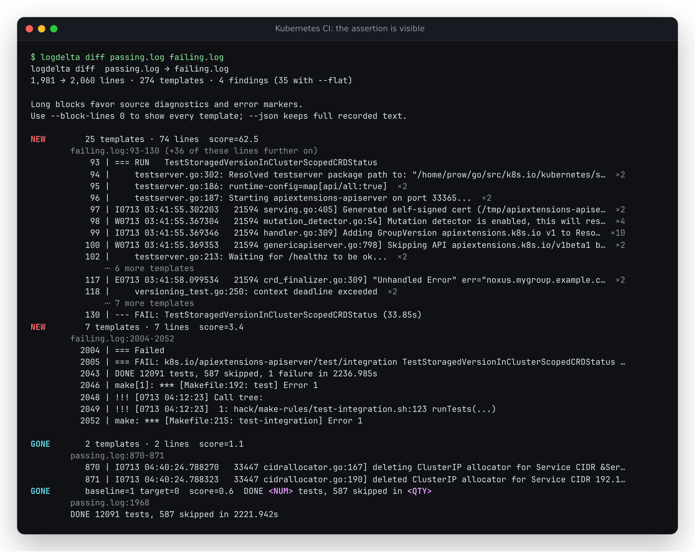
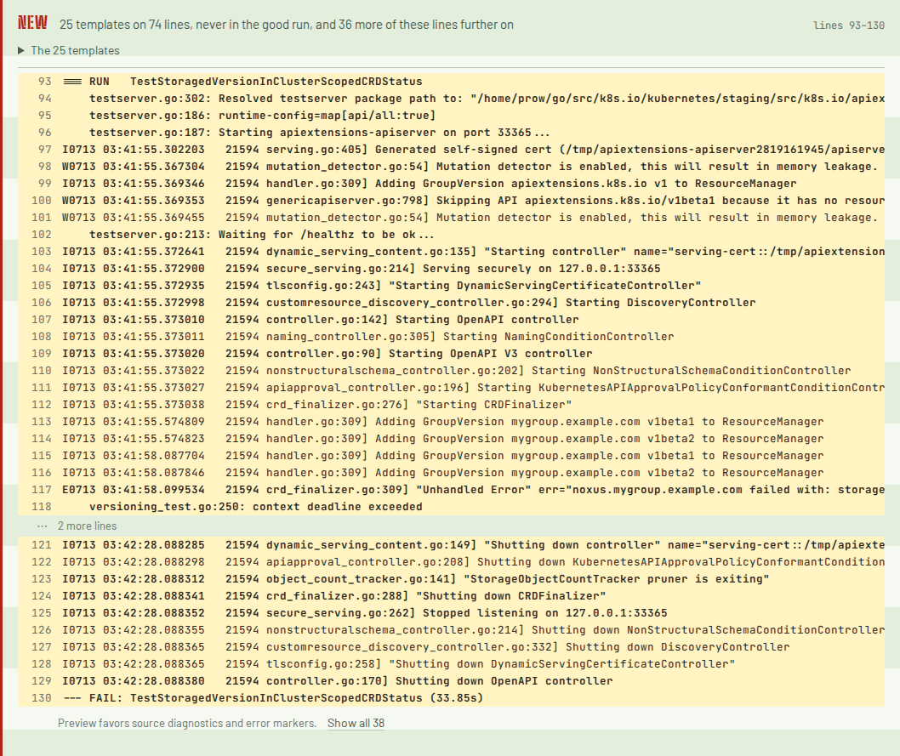

# Finding the assertion inside a long block

The source checkout keeps source diagnostics and error markers in abbreviated block
reports. This is unreleased; the published 0.3.4 package uses the previous head/tail view.

In Kubernetes integration build `2076510297404739584`, the failed test says
`versioning_test.go:250: context deadline exceeded` at log line 118. Logdelta already
grouped it with the test's startup and shutdown messages. Its default terminal excerpt
showed the first eight and last four templates, hiding that assertion in the middle.



The inputs in this capture are unedited copies of builds `2076525647693352960`
(passing) and `2076510297404739584` (failing), renamed `passing.log` and `failing.log`
for the command. Both are in the study's cached corpus and manifest.

## What is selected

The default budget remains 12 template representatives. The report keeps the block's
first and last representative and marked lines already visible in its previous
head/tail view. Remaining slots favor standalone source locations, exception/panic
messages and compiler/pytest diagnostics, then error/fatal/panic markers. Ties favor
later messages; unused slots retain ordinary lines at the boundaries. Display order
always follows source order. Tiny explicit budgets still work: one line chooses a
diagnostic when available, and two keep the opening plus a diagnostic.

These patterns are a reading aid. `helper.go:12: server started` is a source diagnostic
too; a message saying no error occurred can match an error marker. Selection does not
change a finding's kind, score, counts, block membership or recorded evidence.

Each gap counts omitted **template representatives**, not raw log lines. A repeated
template still has only its first source example and an occurrence count. To expand:

```sh
logdelta diff passing.log failing.log --block-lines 0
logdelta diff passing.log failing.log --json
```

The first command shows every representative but still clips long lines to the
terminal width. JSON preserves the full recorded strings. Neither command reconstructs
all occurrences; open the original source at the reported locations for those.

The browser uses the same marker definitions with its existing limits: 36 raw lines
for a new block, 12 representatives for a gone block, expansion up to 2,000 rows. One
button expands all omitted stretches and retains keyboard focus. It says when its
expansion limit leaves rows unseen. Full downloads retain every finding.



The browser retains its existing continuous-paper layout and selectable monospace
source lines. At 375px the page fits; long source lines scroll horizontally inside
the log pane. The assertion's whole text therefore needs horizontal scrolling on a
narrow screen. [Chromium mobile](assets/excerpts-chromium-mobile.png),
[Firefox desktop](assets/excerpts-firefox-desktop.png), [Firefox mobile](assets/excerpts-firefox-mobile.png).

## Measurement

Fresh execution of the pre-change binary (`2f8fb65`) and the changed binary on all
264 cached Kubernetes cases, with the same inputs and settings:

| Measure | Before | After |
|---|---:|---:|
| Recorded reason visible, one baseline | 159 / 239 | 212 / 239 |
| Newly visible / previously visible but lost | - | 53 / 0 |
| Median terminal report lines | 34 | 40.5 |
| Recorded reason visible, up to three baselines | 141 / 206 | 183 / 206 |
| Passing controls with no findings | 127 / 179 | 127 / 179 |
| Reason visible with `--block-lines 0` | 223 / 239 | 223 / 239 |

This is **in-sample**: the corpus informed the change. A preliminary rule preferred
late diagnostics too aggressively; the retained rule preserves marked lines already
visible at the boundaries. The study's reason is the last matching source diagnostic
from the failed test's JUnit output. Some are ordinary log messages, not assertions or
proven causes. The result measures visibility of that recorded text, not debugging
success or generalization to other projects.

Eleven recorded reasons remain outside the abbreviated view. Sixteen are absent even
when all representatives are printed; changing excerpts cannot recover a later
occurrence that was not retained. [Per-case results and binary/manifest digests](../studies/kubernetes-ci/excerpt-results.json).

[An independent JSON comparison](verification-excerpts-native.json) checks every field
of the before/after single-baseline reports for all 264 cases. They are identical.
The corpus evaluator now aborts on missing inputs, failed commands or empty output.
It cannot silently report a successful subset after a tool error.

## Browser and package verification

[The browser capture script](../web/scripts/verify-excerpts.mjs) loads the actual two
log files into the production WASM app in Chromium and Firefox, checks that line 118
is visible among the 36 preview rows, expands to all 38 source lines by keyboard,
and compares the actual downloaded report with the native result. Counts, source
text, ordering and membership agree exactly. Native/WASM logarithm rounding differs
by at most `1.43e-14` in scores; the verifier permits `1e-12` relative tolerance only
for score fields. All other fields require exact equality.

Four desktop/mobile accessibility scans returned no axe violations; no page errors
or off-origin requests were observed. Screenshots were opened and visually inspected.
[Capture metadata, hashes and numeric differences](verification-excerpts-browser.json).

A clean detached checkout passed the native suite (188 tests and one doctest),
formatting, Clippy, the build without default features, and the WASM wrapper's test
and Clippy checks. Under Node 24.21.0, a fresh `npm ci` passed lint, typechecking,
61 web unit tests, and all 82 Chromium/Firefox browser scenarios. These include
keyboard expansion, narrow layouts, downloads, worker recovery and production
cache updates. The WASM build verifier passed all 20 compiler/cache/configuration
cases. Cargo's package contains the shared patterns and excerpt fixtures.

All 34 production files matched the working build byte for byte, despite that
build using Node 26.7.0. [Asset hashes](verification-excerpts-assets.json).

To repeat locally after collecting the study corpus:

```sh
cargo build --release --locked
python3 studies/kubernetes-ci/evaluate.py --label diagnostic-excerpts --out /tmp/excerpt-results.json
cd web && npm ci && npm run build
npm run preview -- --host 127.0.0.1 --port 4194 --strictPort
# In another terminal, from web/:
node scripts/verify-excerpts.mjs
```

The static build is `web/dist/`. No deployment is part of this change.
