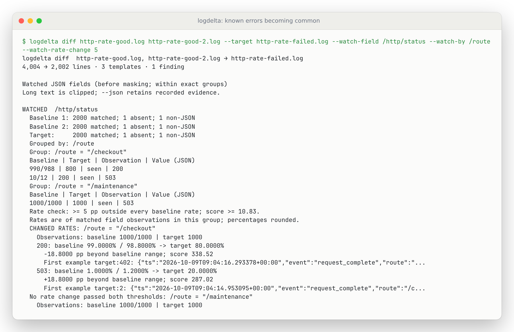
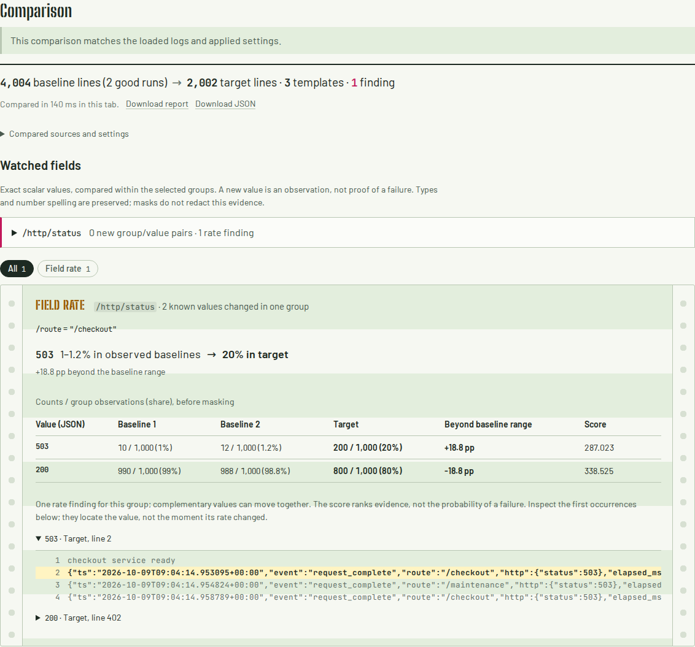

# When an already-known error becomes common

`--watch-rate-change 5` adds a rate comparison to explicit JSON field watches.
It is available in the source checkout's CLI, Rust library, direct WASM request
and browser. The CLI option is not yet in a registry release.

A new-value watch cannot catch a 503 that was already present in passing runs.
In the [captured HTTP example](../examples/http-rates/README.md), checkout returns
503 for 10 and 12 of 1,000 requests in the baselines, then 200 of 1,000 in the
target. Templates and exact values stay the same. The rate comparison reports
one changed group, with the 503 increase and corresponding 200 decrease.

```sh
cargo run --release -- diff examples/http-rates/http-rate-good.log \
  examples/http-rates/http-rate-good-2.log \
  --target examples/http-rates/http-rate-failed.log \
  --watch-field /http/status --watch-by /route --watch-rate-change 5
# One finding, exit 1. Remove --watch-rate-change 5: zero findings, exit 0.
```

| Route | Value | Baseline 1 | Baseline 2 | Target | Result |
| --- | --- | ---: | ---: | ---: | --- |
| `/checkout` | `503` | 10/1,000 (1%) | 12/1,000 (1.2%) | 200/1,000 (20%) | +18.8 percentage points beyond the baseline range |
| `/checkout` | `200` | 990/1,000 (99%) | 988/1,000 (98.8%) | 800/1,000 (80%) | -18.8 percentage points beyond the baseline range |
| `/maintenance` | `503` | 1,000/1,000 | 1,000/1,000 | 1,000/1,000 | Unchanged |



## In the browser

In [the web app](https://antonsoo.github.io/logdelta/), choose **HTTP: a known error
becomes common**. It loads the captured logs, watches `/http/status` within
`/route`, and enables **Compare rates of known values** with a five-point minimum.
For your own logs, select the fields and grouping keys, enable that checkbox,
and choose a minimum in `(0, 100]`. Five points means a change such as 1% to 6%,
not a 5% relative increase.

The rate finding shows the observed baseline range, target share, exact counts
and denominators, signed distance beyond the range and score. Known values that
rise and fall together share one group finding. Open a source occurrence to see
its original line and target context. An outcome absent from the target uses its
first baseline occurrence instead. These records locate the value; they do not
identify when a rate changed.



Open the **Watched fields** ledger to inspect unchanged values and groups too.
Search and pagination apply to that view; both downloads retain all evidence.
Missing groups are labelled **Unobserved**, never 0%. An incomplete field ledger
has counts but no rate denominators. Either condition keeps the overall report
incomplete even if another group has a valid finding.

**Download report** uses schema version 3 when rates are requested and records
`settings.watch_rate_change` alongside sources and the executed engine's SHA-256.
**Download JSON** retains the native result structure. Editing the checkbox or
threshold cancels pending work and marks an existing report stale; its downloads
continue to describe the settings actually used. Comparisons and downloads work
offline after the app and inputs have loaded.

[Browser verification and retained download](verification-browser-rates.md).

## What qualifies as a rate finding

For each field and exact group, the denominator is the number of scalar
observations of that field in that group. Unrelated log lines, absent fields
and other routes do not enter it. Without `--watch-by`, all matched observations
of the field are pooled. Use grouping when a change in traffic mix would otherwise
look like a change in outcomes.

A known value must pass both conditions:

1. Its target fraction lies outside **every observed baseline fraction** by at
   least the requested number of percentage points. `5` means five points, not
   a 5% relative increase. The inclusive threshold must be finite and in `(0, 100]`.
2. Its score reaches `--significance` (default `10.83`). The existing scorer
   compares pooled baseline value/other counts with target value/other counts,
   adds 0.5 to each cell, and divides the G statistic by `1 + 2 * CV`, where CV
   describes the variation in per-run baseline fractions.

For example, baseline rates of 1% and 30% with a 20% target produce no rate
finding, even when pooling those baselines would yield a large score. A group
absent in one baseline contributes an unobserved fraction, not an invented 0%.
Other observed baselines can still support the comparison.

Known values can rise, fall, or disappear while their group remains observed.
Entirely new values retain their existing exact novelty findings. Several
qualifying known values in a group count as one **rate** finding; a new value
can independently add a novelty finding in that group. Template findings still
run alongside both.

## Coverage and exit status

| Condition | Rate result | CLI exit |
| --- | --- | ---: |
| Complete field ledger and observed groups; no findings of any kind | Complete | 0 |
| Complete comparison; at least one finding | Complete | 1 |
| Group observed only in target | No baseline observations; no rate assigned | 2 |
| Group observed only in baselines | No target observations; no rate assigned | 2 |
| Incomplete field coverage or truncated value ledger | No rate denominators or rate findings computed for that field | 2 |

An unobserved group is not a measured 0% outcome. Its exact novelty ledger can
still be complete while its rate comparison is incomplete. Incompleteness takes
precedence over findings for the exit status. The existing
[field coverage rules and limits](watched-fields.md#coverage-and-limits) still apply.

## Inspect the evidence

Terminal and Markdown reports include exact counts, group denominators, rounded
fractions, signed distance beyond the baseline range, score and first source
occurrences. A value absent from the target uses its first baseline source.
`-C N` adds bounded **target** context; no baseline context is synthesized.
`--json` retains full-precision numeric results and the exact scalar ledger.

Each selected field gains an optional `rate_comparison` only when requested:

```text
watched_fields[]
  values[]                   exact values, counts, first sources and target context
  rate_comparison
    min_change_pp, significance, complete
    groups[]                 exact group keys and per-run observation totals
      status                 compared | no_baseline_observations | no_target_observations
      changes[]
        value_index          index into this field's values[]
        baseline_rates[]     fractions 0..1; null for an unobserved baseline group
        target_rate          fraction 0..1
        range_distance_pp    signed percentage points beyond the nearest range edge
        score                heuristic, not a p-value
```

Rust callers set `DiffOptions.watch_rate_change = Some(5.0)`; direct WASM
requests use `"watch_rate_change": 5` with `watch_fields` and optional `watch_by`.
Consumers must check both `field.complete` and `rate_comparison.complete`.
Omitting the option preserves the existing novelty-only behavior and JSON shape.

## Interpretation limits

This is a triage heuristic over logged observations. Counts may include retries,
duplicate logs or correlated requests. There is no exposure-time normalization,
confidence interval, multiple-comparison correction or causal inference. Missing
individual fields and lost logs can bias a denominator without being detectable.
The observed baseline range is not a population confidence interval.

Do not interpret the score cutoff as a guaranteed false-alarm probability. In
the retained sparse example, 1/1,000 versus 1/5 produces a smoothed G score of
11.63 and passes the default cutoff, while an independent two-sided Fisher
exact calculation gives about 0.00993. Sparse tables do not support a simple
chi-square interpretation of the cutoff. Choose a useful effect threshold and
inspect the actual counts. [Verification, oracle and retained limitations](verification-field-rates.md).
