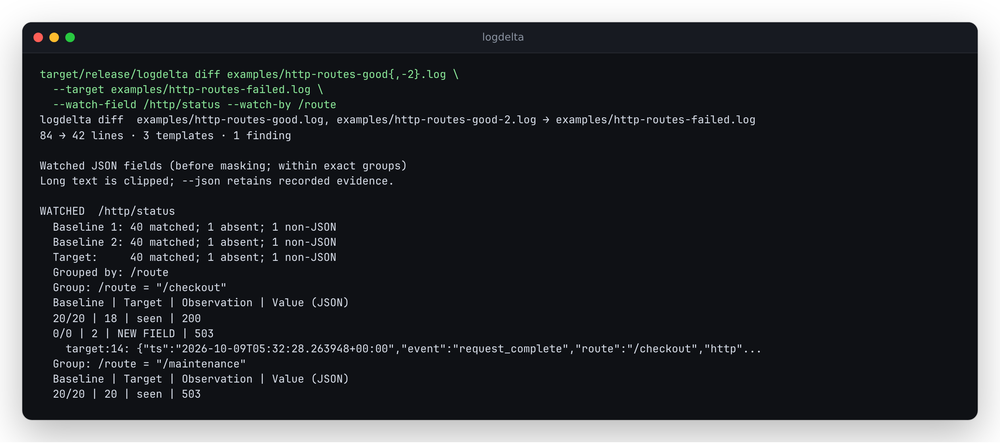

# Grouped field watches: local verification

Checked 2026-10-09 UTC. Source additions only; neither the crate nor the hosted
browser demo has been published with these changes.

## The behavior that changed

A status-only watch misses an error that was already observed on another route.
The current checkout was first reproduced returning no findings and exit 0 when
checkout started returning 503 but maintenance already returned 503. Template
counts and shapes were unchanged. The optional `--watch-by /route` now compares
each route's outcomes separately, in the native CLI and the browser's real WASM
engine. [Usage and exact semantics](watched-fields.md#compare-within-routes-or-services).

The committed mixed-route capture comes from a loopback HTTP server with a
deliberate fault. Its client checks response codes, bodies, emitted records and
the subprocess exit. It is an integration experiment, not a production incident.

| Route | Each of two baselines | Target | Grouped finding |
| --- | --- | --- | --- |
| `/checkout` | 20 responses with status 200 | 18 with 200, 2 with 503 | First 503 at target line 14; target count 2 |
| `/maintenance` | 20 responses with status 503 | 20 with 503 | None; this exact pair was already observed |

All 120 client-observed responses agree with the committed server logs.
[`http-routes-observed.json`](../examples/http-routes-observed.json) retains those
client observations, separately from the emitted logs. Each log has 42 lines:
40 requests, a readiness line and a process-exit record.

| Invocation on the capture | Field findings | Exit |
| --- | ---: | ---: |
| Watch `/http/status`, pooled | 0 | 0 |
| Watch `/http/status`, grouped by `/route` | 1 | 1 |
| Good against good, grouped by `/route` | 0 | 0 |
| Group by an unobserved `/missing` key | Unknown; coverage incomplete | 2 |



## Independent counting and source evidence

[`scripts/verify_grouped_fields.py`](../scripts/verify_grouped_fields.py) uses the
Python standard library's `Counter` to calculate expected group/value counts
from decoded records, without using the Rust tracker. It checks the HTTP client
observations above, then generates 40 seeded cases containing one to three
baselines, mixed JSON types, sparse fields, reordered records, multiple watched
fields and both single and composite grouping keys.

The resulting 80 field comparisons cover 3,242 retained entries. Exact keys,
per-run counts, novelty, baseline group membership, first source line numbers
and original source excerpts agree. These checks exercise a separate count
implementation; they do not establish performance or accuracy on production
traffic. Native integration cases additionally exercise duplicate group keys,
malformed/missing/non-scalar keys, JSON Pointer escaping, large integers,
number spelling, Docker envelopes, masking and retention overflow.

Reproduce from the repository root:

```sh
cargo build --release
python scripts/verify_grouped_fields.py --benchmark-lines 100000
```

The recorded [result and input/binary digests](verification-grouped-fields.json)
are from that command. A fresh package was also verified and installed in a
temporary directory using `cargo package --allow-dirty --locked --offline` and
`cargo install --path target/package/logdelta-0.3.4 --locked --offline` with an
isolated install root and build directory. The installed binary produced the
same full JSON as the native checkout for pooled, grouped and incomplete
comparisons, including a gzip baseline combined with a stdin target. No global
installation was changed.

## Browser workflow

Both Chromium 153.0.8010.12 and Firefox 155.0 ran the local production build.
The downloaded report's entire result equals native `--json -C 2` on the same
capture. The engine digest and screenshot digests are recorded in
[`verification-grouped-browser.json`](verification-grouped-browser.json).
No page errors or external requests occurred during these captures.

To regenerate the browser evidence, first build the native CLI and the web app,
then keep `npm --prefix web run preview -- --host 127.0.0.1 --port 4197 --strictPort`
running. From another terminal at the repository root, run
`node web/scripts/capture-grouped-evidence.mjs`. It compares actual downloaded
reports with the native result and writes the screenshots and digest record.

The browser checks cover the pooled/grouped contrast, exact group columns,
baseline values restricted to the selected group, source lines, exports with
applied settings, incomplete coverage, entirely new groups, composite keys,
large integer identity, HTML-like keys, retention overflow and reset. A real
WASM response with grouping deliberately removed from the request is rejected;
the completed report remains available and a fresh comparison recovers.

Keyboard and accessibility checks pass at 320 pixels in light and dark modes.
The controls share a row below the two log editors on larger screens and stack
on phones. Long tables and raw log lines scroll horizontally inside the report;
the page itself does not overflow. Screenshots were opened and reviewed after
the control layout and route-column widths were adjusted.

| View | Screenshot |
| --- | --- |
| Input controls | [Desktop](assets/grouped-fields/controls.png) |
| Full evidence and finding | [Chromium](assets/grouped-fields/chromium-evidence.png), [Firefox](assets/grouped-fields/firefox-evidence.png) |
| Finding on a phone, dark theme | [375 px](assets/grouped-fields/mobile-dark.png) |
| Missing group key on a phone | [375 px, incomplete](assets/grouped-fields/mobile-incomplete.png) |

The production site is built with `cd web && npm ci && npm run build`; output is
`web/dist/`. It has not been deployed. Grouped portable reports use schema version
2; pooled reports keep version 1. The raw native result remains the same shape
as the browser result, with grouping properties added only when requested.

## Cost and bounds

On this WSL2 Linux machine (14 logical CPUs, 48,176 MiB RAM exposed to WSL), two
synthetic files of 100,000 lines each totaled 13,177,780 bytes. The release CLI
gave these single-process measurements with a warm filesystem cache; other
local builds were active. This is a workload check, not a throughput guarantee.

| Watch mode | Elapsed seconds | Peak RSS, KiB | Retained entries |
| --- | ---: | ---: | ---: |
| Pooled status | 0.6846 | 7,772 | 2 |
| Status grouped by service and route | 0.7246 | 8,012 | 17 |

The tracker retains at most 256 group/value pairs per watched field, with at
most 4 KiB of encoded group components per key and 4 KiB per value. Existing
record, excerpt and context limits also apply. New pairs beyond the limit are
counted as untracked; already retained pairs continue accumulating counts. Any
such loss makes novelty unknown for the entire affected watch and returns exit
2. Template diversity and the number of input runs also affect total memory.

## Checks and remaining limits

| Check | Result |
| --- | --- |
| `cargo test --all-targets --all-features` | 195 passed |
| `cargo test --doc` | 1 passed |
| `cargo test --manifest-path web/wasm/Cargo.toml` | 2 passed |
| Native and WASM rustfmt/clippy | Clean |
| `cargo +1.85.0 check --locked --all-targets --all-features` | Passed on the declared minimum Rust version |
| `cargo build --lib --no-default-features` | Passed |
| `npm ci`, lint, typecheck, production build | Passed |
| `npm test` | 67 passed |
| `npx playwright test` | 96 passed across Chromium and Firefox |
| `npm run verify:wasm` | All 20 compiler/configuration and failure-recovery cases passed; independent checkout builds produced identical WASM bytes |

Grouping does not detect changed proportions of already-known values, missing
individual watched fields, disappearing groups, ordering changes or plain-text
access-log statuses. Every requested grouping pointer applies to every watched
field. New groups are explicitly labeled as absent from baseline observations;
they do not establish a changed outcome in an observed group. The default pooled
comparison and template analysis remain available.
