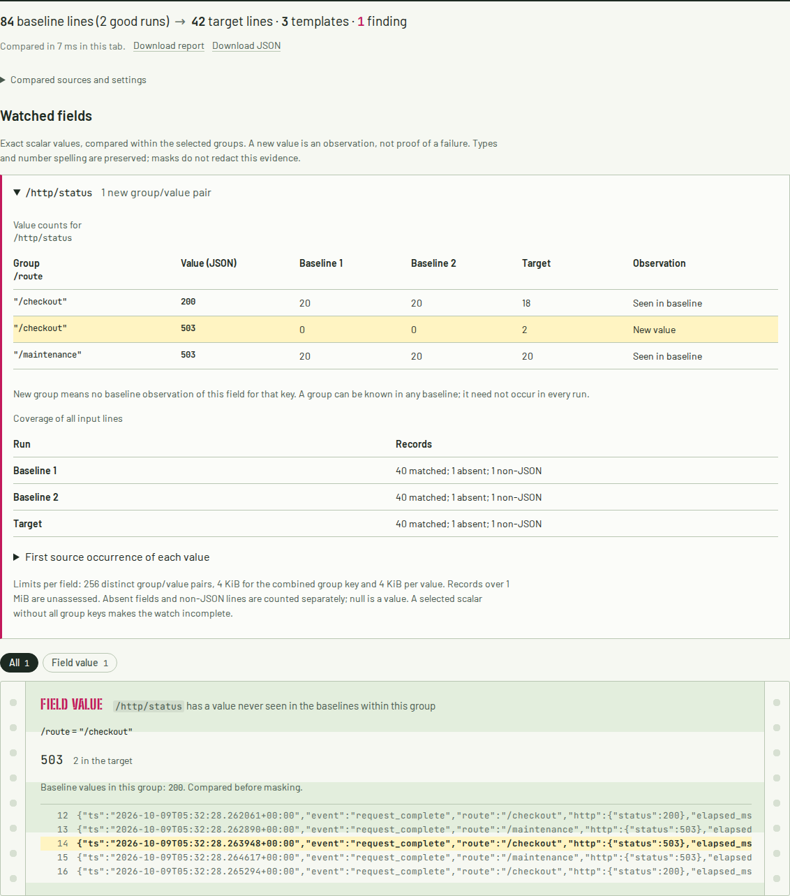
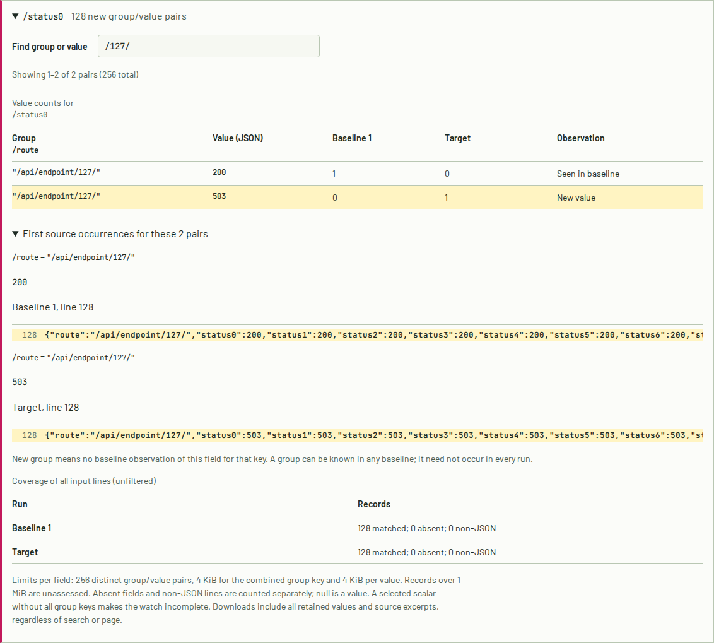

# When a status change disappears into a template

These commands use the current source checkout. Field watches are not in the
published 0.3.4 package.

The HTTP example is a controlled local experiment: a Python HTTP server handles
20 checkout requests per run. Two good runs return 200 throughout. A fault
injected into the third run returns 503 twice and makes the process exit 1. The
capture script checks the actual HTTP responses and subprocess exit against the
server's log records. It does not demonstrate a production incident.

```sh
# Optional: capture fresh logs from a real loopback server (Python standard library).
python examples/capture_http.py

# Same templates and counts: no findings, exit 0.
cargo run --release -- diff examples/http-good.log examples/http-good-2.log \
  --target examples/http-failed.log

# Exact outcome changes: two findings, exit 1.
cargo run --release -- diff examples/http-good.log examples/http-good-2.log \
  --target examples/http-failed.log \
  --watch-field /http/status --watch-field /exit_code
```

| Field | Value (JSON) | Good run 1 | Good run 2 | Target | Observation |
| --- | --- | ---: | ---: | ---: | --- |
| `/http/status` | `200` | 20 | 20 | 18 | Seen in baselines |
| `/http/status` | `503` | 0 | 0 | 2 | New; first at target line 8 |
| `/exit_code` | `0` | 1 | 1 | 0 | Seen in baselines |
| `/exit_code` | `1` | 0 | 0 | 1 | New; target line 22 |

Numbers normally become `<NUM>` during template mining. A field watch runs
separately, before built-in or custom masks. It compares each selected scalar
against the union of values observed in all baselines. No repetition or
significance threshold applies: selecting the field explicitly says that its
exact values matter. Every distinct new target value is reported.

In the local browser build, choose **HTTP: a failure hidden by masking**. It
loads both baseline files and both watches. Open a watched field to inspect
per-run counts, coverage and first source occurrences. Clear the watches and
compare again to see the limitation of template comparison directly. Edits mark
the previous report as stale; its downloads retain its original settings and
evidence until a replacement comparison succeeds.

## Compare within routes or services

A pooled watch cannot distinguish an expected error on one route from the same
error appearing on another. The mixed-route HTTP capture demonstrates this with
actual requests to the local server: `/maintenance` always returns 503, and two
`/checkout` requests start returning 503 in the target. Both codes already exist
in the baselines, so `--watch-field /http/status` alone reports no findings.

```sh
# Optional: capture fresh requests without replacing the committed evidence.
python examples/capture_http.py --scenario mixed-routes --output-directory /tmp/http-routes

# Pooled values: no findings, exit 0.
cargo run --release -- diff examples/http-routes-good.log examples/http-routes-good-2.log \
  --target examples/http-routes-failed.log --watch-field /http/status

# Compare each route separately: one field finding, exit 1.
cargo run --release -- diff examples/http-routes-good.log examples/http-routes-good-2.log \
  --target examples/http-routes-failed.log --watch-field /http/status --watch-by /route
```

| `/route` (JSON) | `/http/status` (JSON) | Good 1 | Good 2 | Target | Observation |
| --- | --- | ---: | ---: | ---: | --- |
| `"/checkout"` | `200` | 20 | 20 | 18 | Seen in baselines |
| `"/checkout"` | `503` | 0 | 0 | 2 | New in this group; target line 14 |
| `"/maintenance"` | `503` | 20 | 20 | 20 | Seen in baselines |



The capture script checks 120 HTTP responses across the three runs against the
emitted log records. Client observations are saved in
[`http-routes-observed.json`](../examples/http-routes-observed.json); timestamps
and durations come from the server. The fault is injected. This is a controlled
experiment, not evidence from a production incident.

In the local browser build, choose **HTTP: an error on the wrong route**. It sets
the watched field to `/http/status` and **Compare within groups** to `/route`.
Clear the latter and compare again to see the pooled result. The previous report
and its downloads keep their applied settings while an edit is awaiting comparison.

### Find a route in a large ledger

Open a watched field and use **Find group or value**. Search is a case-insensitive
substring of the displayed JSON scalar text; it changes the view, not the comparison.
The ledger shows 32 values or group/value pairs per page. **First source occurrences**
shows the source records for that page, so searching for a route also finds its
baseline and target evidence. The displayed coverage always includes all input lines.

Both downloads retain every tracked value and source excerpt, including rows hidden
by search, pagination or a closed fold. Closing and reopening a field preserves its
search and page; running a new comparison resets them.



Closed field ledgers do not render hidden tables or excerpts. The
[large-ledger verification](verification-field-ledger.md) measures this change and
checks downloaded evidence against the native result. The engine still retains the
complete bounded result in memory, so large values and repeated excerpts can produce
a download much larger than the input.

Repeat `--watch-by` to form a composite key, for example
`--watch-by /service --watch-by /route`. Up to four pointers apply to **every**
watched field. Each group component uses the same exact scalar rules as watched
values: `1`, `1.0`, `"1"`, `true` and `null` are different keys. Strings are decoded,
but Unicode normalization is not applied. Components are kept separately, so
separators inside a service or route name cannot merge two different tuples.
Use stable service names or route templates; individual request IDs and URLs
containing unique identifiers will quickly reach the pair limit.

| Baseline observations for this field and group | Target pair | Report |
| --- | --- | --- |
| Same exact group and value in any baseline | Present | Seen in baseline |
| Same group, but this value absent from every baseline | Present | New field value |
| No observation of the field in this group in any baseline | Present | New group; the value is shown, without claiming a changed outcome in an observed group |
| Any incomplete coverage for the watched field | Retained | Unknown; exit 2 |

A group need not occur in every baseline. Every input run must still have at
least one usable observation of each selected field, and no unassessed records.
A watched scalar without all group keys makes that watch incomplete, rather
than silently omitting an unassignable observation. Events without the watched
field remain separately counted and do not require group keys. For example,
watching both `/http/status` and `/exit_code` with `--watch-by /route` is incomplete
if the exit records have no route. Compare such fields in separate invocations.

Grouping is optional and changes only exact field watches. It does not filter
the input or alter template mining, frequency tests, block grouping or existing
wildcard-value findings. [Verification and limits](verification-grouped-fields.md).

## Choosing a field

Use one [JSON Pointer](https://www.rfc-editor.org/rfc/rfc6901.html) per
`--watch-field`, or one per line in the browser. Pointers start with `/` and are
evaluated against a single-line JSON **object** after recognized log envelopes
are removed. This includes Docker json-file, CRI, journald and leading timestamps.
There are no wildcards, JSONPath expressions or implicit nested-key searches.

| Record | Pointer | Selected value |
| --- | --- | --- |
| `{"status":503}` | `/status` | `503` |
| `{"http":{"status":503}}` | `/http/status` | `503` |
| `{"http.response.status_code":503}` | `/http.response.status_code` | `503` |
| `{"a/b":{"~key":false}}` | `/a~1b/~0key` | `false` |
| `{"attempts":[{"code":1}]}` | `/attempts/0/code` | `1` |
| `{"":null}` | `/` | `null` |

Keys, including spaces and Unicode, are exact. JSON string escapes are decoded,
so `"a"` and `"\u0061"` compare equal. Types and **number spelling** are retained:
`200`, `200.0`, `2e2` and `"200"` are four distinct watched values. Large integers
and exponents never pass through floating-point conversion. This is deliberate
exact comparison, not numeric tolerance or a latency-regression detector.
It compares the text supplied by the existing log decoder, including that
decoder's replacement of malformed encoding.

## Coverage and limits

A watch is complete only if **each baseline and the target** contains at least
one selected scalar, and no relevant records or values were left unassessed.
Null and booleans are scalars. A missing field is counted separately from null;
unrelated plain-text lines are also counted separately. Neither creates a new
field value. They do not make a watch incomplete if each run still has a scalar
observation. This accommodates mixed event types in one file.

| Condition | Result |
| --- | --- |
| Invalid, repeated or oversized pointer; more than 16 watches | Input error |
| More than 4 grouping pointers, repeated/invalid grouping pointer, or grouping without a watch | Input error |
| No selected scalar in any one run, including an empty run | Incomplete watch |
| Malformed object-shaped JSON or a duplicate member on the selected path | Incomplete; first problem line retained |
| Selected array or object | Incomplete; select a scalar inside it |
| Pooled watch: more than 64 distinct values across the combined runs | Incomplete; first 64 retained, other occurrences counted as untracked |
| With grouping: more than 256 distinct group/value pairs across the combined runs | Incomplete; first 256 pairs retained, other occurrences counted as untracked; replaces the pooled 64-value limit |
| Selected scalar has a missing, non-scalar or ambiguous group key | Incomplete; counted as `group_missing`, `group_non_scalar` or `group_ambiguous`, with first problem line |
| Group components' encoded JSON text exceeds 4 KiB in total | Incomplete; counted as untracked |
| Encoded scalar larger than 4 KiB | Incomplete; counted as untracked |
| Input line larger than 1 MiB | Incomplete; counted as oversized |
| Raw source excerpt larger than 4 KiB | Excerpt clipped at a UTF-8 boundary and labelled; selected value remains complete |
| Watched-value context exceeds 8 KiB total or 10 lines per side | Keep nearest lines first, at most 4 KiB per line; label the clipped context |

For incomplete watches, counts and retained source records remain visible, but
`is_new` is `null`. An incomplete baseline cannot prove a value was never seen.
`matched` includes scalar occurrences whose values exceeded a limit; `untracked`
is that subset, not an additional class of lines. A complete watch says the
requested values were assessed, not that the logs themselves are complete.
For grouped watches, `matched` requires the watched scalar and all group scalars
to be selected. The three group-error counts classify records separately from
`matched`; a key or pair that exceeds a size/count limit is instead `untracked`
within `matched`. Group-error properties are omitted from JSON when zero.

The CLI emits a report even for incomplete watches and gives them precedence
over findings when choosing the exit status:

| Exit | Meaning |
| ---: | --- |
| 0 | Comparison complete; no findings under these settings |
| 1 | Comparison complete; at least one template, value or watched-field finding |
| 2 | Input/analysis error or at least one incomplete watch |

## Evidence and scope

CLI `--json` adds `watched_fields` only when a watch was requested. Each field
contains `pointer`, `complete`, per-run coverage and `values`. Each value has
per-baseline counts, a target count, `is_new`, first baseline/target occurrences,
and optional bounded target context from `-C` (`context_truncated: true` when
clipped). `value_json` is **a string containing a
JSON scalar**, so JavaScript consumers do not round a large number. Do not parse
it into a JavaScript `Number` if exactness matters. All counts are occurrence
counts, not independent trials or probabilities.

Browser report downloads also record `settings.watch_fields`. The raw JSON
download is the same result shape as the native engine. Both include original
values and source excerpts, including known values used to assess the watch;
mask rules do **not** sanitize either download. Full input logs are not bundled.

Grouped JSON adds `group_by` to each watched field and `group_values_json` to
each value row. The latter contains encoded scalar strings in pointer order;
keep them as strings to preserve large numbers. On a complete grouped watch,
`group_seen_in_baseline` records whether the group had an observation of this
field in any baseline. It is absent when coverage is incomplete. `is_new`
means a new **group/value pair** in grouped mode, including entirely new groups.
Counts and first source locations refer to that exact pair.

Browser reports with grouping use `schema_version: 2` and include
`settings.watch_by`. Pooled reports keep version 1 and their existing structure;
the native JSON result is the same in both exports. The browser rejects an
engine response that omits or changes the requested grouping.

Without `--watch-by`, watches pool all records in a run. Use grouping or filter
the input to the service/route/event of interest when those distinctions matter.
By default, watches compare novelty only. In the CLI, add
[`--watch-rate-change 5`](field-rates.md) to detect changed proportions of already-known
values with a five-percentage-point minimum effect and the existing score cutoff.
The browser page still performs novelty-only watches. Watches do not detect missing
individual fields, record ordering, or changes in a plain-text access-log status.
Disappearing groups are not novelty findings; with rate comparison requested,
their rates are unknown and the comparison exits 2. Default template and frequency
findings still run alongside the watches. A finding is evidence to inspect, not a
causal diagnosis.

Field tracking retains a bounded value ledger per watch and streams the input;
it does not retain every record. The existing miner still retains distinct
templates, so overall memory also depends on template diversity.
